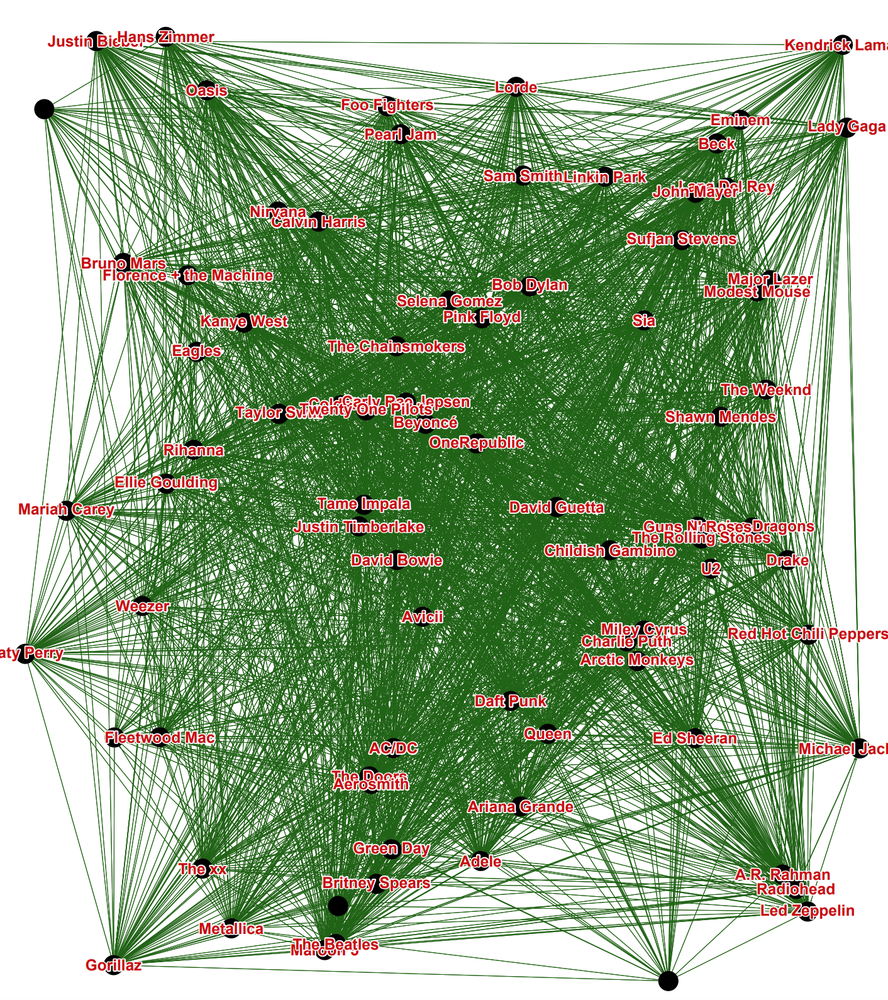

# Aplicação de Teoria dos Grafos

Ferramenta para a análise ods principais artistas do mundo segundo o Last.fm.
Neste repositório temos uma ferramenta que constrói, a partir de dados do [Last.fm] (https://www.last.fm/api), um grafo dos principais artistas do mundo e as conexões entre eles (que neste caso são os países em que ambos se encontram na lista de Top 50).

## Dados

Em [subfolder](data/) estão os CSVs que foram gerados a partir da API do Last.fm

## Grafo

